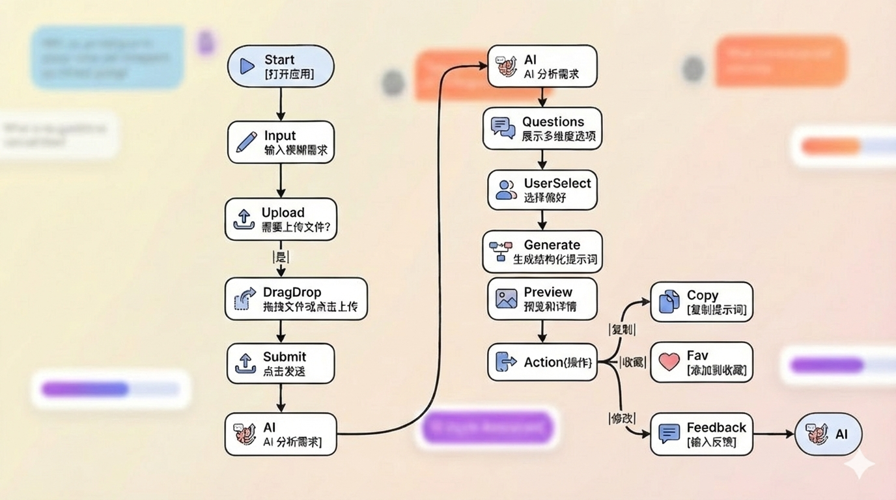
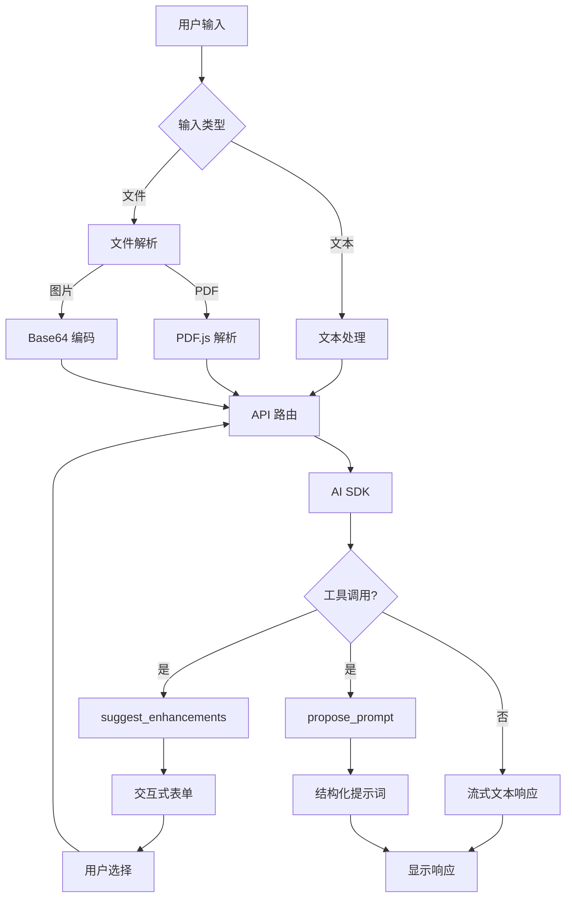
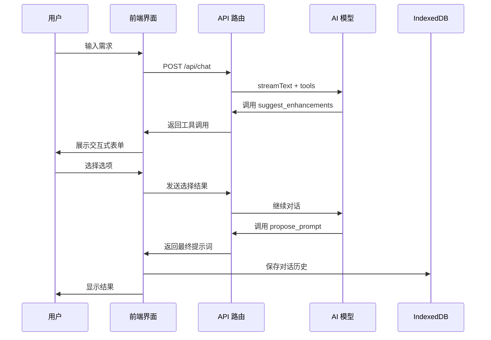

<div align="center">
  


  # 🚀 交互式提示词迭代器

  ### Interactive Prompt Iterator

  <p align="center">
    <strong>通过多轮交互式对话，将模糊想法转化为结构化、高质量的 AI 提示词</strong>
  </p>

  <p align="center">
    <a href="https://github.com/systemoutprintlnhelloworld/interactive-prompt-iterator/stargazers">
      
    </a>
    <a href="https://github.com/systemoutprintlnhelloworld/interactive-prompt-iterator/network/members">
      
    </a>
    <a href="https://github.com/systemoutprintlnhelloworld/interactive-prompt-iterator/blob/master/LICENSE">
      
    </a>
    <a href="https://interactive-prompt-iterator.vercel.app">
      
    </a>
  </p>

  <p align="center">
    <a href="https://nextjs.org/">
      
    </a>
    <a href="https://www.typescriptlang.org/">
      
    </a>
    <a href="https://tailwindcss.com/">
      
    </a>
  </p>

  <p align="center">
    <a href="README.md">简体中文</a> •
    <a href="README_EN.md">English</a> •
    <a href="#-功能演示">功能演示</a> •
    <a href="#-本地开发">快速开始</a> •
    <a href="TODO.md">开发计划</a>
  </p>

  <p align="center">
    <a href="https://interactive-prompt-iterator.vercel.app" style="margin-right: 20px;">
      
    </a>
    <a href="https://vercel.com/new/clone?repository-url=https://github.com/systemoutprintlnhelloworld/interactive-prompt-iterator">
      
    </a>
  </p>

</div>

---

## 📑 目录

- [功能演示](#-功能演示)
- [用户交互流程](#-用户交互流程)
- [核心特性](#-核心特性)
- [技术栈](#️-技术栈)
- [快速开始](#-本地开发)
- [项目结构](#-项目结构)
- [开发路线图](#-开发路线图)
- [常见问题](#-常见问题)
- [贡献指南](#-贡献指南)
- [更新日志](#-更新日志)

---

## 📺 功能演示

### 应用概览

<div align="center">
  
  <p><em>交互式提示词迭代器 - 通过多维度选项引导，生成结构化 AI 提示词</em></p>
</div>

### 1. 交互式提示词生成流程
> **场景**: 从模糊需求到精准提示词
>
> 演示：用户输入"帮我写一篇关于AI的文章" → AI提供多维度选项（角色、风格、深度、格式）→ 用户选择偏好 → 生成结构化提示词


#### 多轮交互优化
> 演示：通过多轮对话逐步细化需求，最终生成高质量提示词


### 2. 文件上传与解析
> **场景**: 基于文档内容生成提示词
>
> 演示：上传PDF论文/DOCX报告/图片截图 → 自动解析内容 → AI结合文件内容提供优化建议 → 生成针对性提示词


### 3. 多场景应用示例

#### 📝 场景 1: 技术博客写作

<details>
<summary><kbd>用户输入</kbd>: "帮我写一篇关于 React Server Components 的技术文章"</summary>

**AI 响应**: 立即展示交互式表单

| 维度 | 选项 |
|------|------|
| **角色设定** | 资深前端工程师 / React 核心贡献者 / 技术布道师 |
| **目标受众** | 初学者 / 中级开发者 / 架构师 |
| **内容深度** | 入门概述 / 实战教程 / 架构深度解析 |
| **输出格式** | Markdown 博客 / 演讲稿 / 系列教程 |

**生成的提示词示例**:
```
你是一位拥有 5 年 React 开发经验的资深前端工程师。请撰写一篇面向中级开发者的技术文章,深入讲解 React Server Components 的工作原理、使用场景和最佳实践。

要求:
1. 包含实际代码示例和性能对比数据
2. 解释 RSC 与传统 SSR 的区别
3. 提供迁移指南和常见陷阱
4. 输出格式: Markdown,包含目录和代码高亮
5. 字数: 2000-3000 字
```
</details>

---

#### 💼 场景 2: 数据分析报告

<details>
<summary><kbd>用户输入</kbd>: "分析这份销售数据并生成报告" + 上传 CSV 文件</summary>

**AI 响应**: 解析文件后展示交互式表单

| 维度 | 选项 |
|------|------|
| **分析角度** | 趋势分析 / 对比分析 / 预测分析 |
| **报告受众** | 技术团队 / 管理层 / 客户 |
| **可视化需求** | 图表建议 / 数据透视表 / 仪表盘设计 |
| **输出格式** | PPT 大纲 / Word 报告 / HTML 交互式报告 |

**生成的提示词示例**:
```
你是一位数据分析专家。基于提供的销售数据 CSV 文件,生成一份面向管理层的季度销售分析报告。

分析要求:
1. 识别销售趋势和异常波动
2. 对比不同产品线/区域的表现
3. 提供可操作的业务建议
4. 包含 3-5 个关键可视化图表(折线图、柱状图、饼图)
5. 输出格式: PPT 大纲,包含每页标题、要点和图表说明
```
</details>

---

#### 🎓 场景 3: 学术论文润色

<details>
<summary><kbd>用户输入</kbd>: "帮我优化这段论文摘要" + 粘贴文本</summary>

**AI 响应**: 分析文本后展示交互式表单

| 维度 | 选项 |
|------|------|
| **学科领域** | 计算机科学 / 生物医学 / 社会科学 / 工程技术 |
| **优化重点** | 学术规范 / 逻辑清晰 / 语言精炼 / 创新性突出 |
| **目标期刊** | 顶会(如 NeurIPS) / SCI 一区 / 中文核心 |
| **输出内容** | 修改建议 / 直接改写 / 对比版本 |

**生成的提示词示例**:
```
你是一位计算机科学领域的资深学术编辑,专注于机器学习方向的论文润色。请优化以下论文摘要,使其符合 NeurIPS 顶会的投稿标准。

优化要求:
1. 保持原始技术内容和创新点
2. 优化学术表达,使用领域标准术语
3. 突出研究的创新性和实验结果
4. 控制字数在 150-200 词
5. 提供修改前后对比和修改理由
```
</details>

---

#### 🎨 场景 4: UI 设计需求文档

<details>
<summary><kbd>用户输入</kbd>: "我需要设计一个电商网站的购物车页面"</summary>

**AI 响应**: 立即展示交互式表单

| 维度 | 选项 |
|------|------|
| **设计风格** | 极简现代 / 商务专业 / 活泼年轻 / 奢华高端 |
| **目标用户** | 年轻人(18-30) / 家庭用户 / 企业采购 |
| **核心功能** | 快速结算 / 优惠券系统 / 批量操作 / 推荐商品 |
| **输出格式** | PRD 文档 / Figma 设计说明 / 开发需求 |

**生成的提示词示例**:
```
你是一位拥有 8 年经验的 UX 设计师,专注于电商领域。请为一个面向年轻用户(18-30岁)的时尚电商网站设计购物车页面的需求文档。

设计要求:
1. 采用极简现代的设计风格
2. 核心功能: 快速结算、优惠券系统、商品推荐
3. 移动端优先,响应式设计
4. 输出内容:
   - 页面布局和信息架构
   - 交互流程图
   - 关键组件设计说明(按钮、表单、卡片)
   - 可访问性和性能考虑
5. 格式: Markdown PRD 文档,包含 Mermaid 流程图
```
</details>

> 💡 **提示**: 每个场景都展示了从模糊需求到结构化提示词的完整转化过程,通过交互式表单快速明确用户意图

### 4. 自定义模板管理
> **场景**: 保存和复用常用提示词模板
>
> 演示：创建自定义提示词模板 → 保存到本地 → 切换使用不同模板 → 快速应用到新对话


---

## 🔄 用户交互流程

### 完整使用流程



### 核心交互特性

- **🎯 智能引导**: 通过多维度选项表单,逐步明确需求
- **📁 拖拽上传**: 拖拽文件到页面任意位置,全屏显示上传区
- **⭐ 一键收藏**: 点击收藏按钮切换收藏状态,黄色表示已收藏
- **🔍 快捷搜索**: `Ctrl+K` 打开 Spotlight 搜索,快速查找对话和收藏
- **🎨 流畅动画**: 标签页切换、收藏状态、文件上传都有流畅的动画效果

> 📖 **详细流程图**: 查看 [用户交互流程文档](docs/user-interaction-flow.md) 了解完整的交互流程和时序图

---

## ✨ 核心特性

- **🎯 智能交互引导**：通过交互式表单和多轮对话，逐步明确用户需求
- **💾 本地优先 (Local-First)**：
  - 配置存储：使用 `Zustand` + `LocalStorage` 存储 API Key 和模型偏好
  - 历史记录：使用 `Dexie.js` (IndexedDB) 存储对话记录，支持离线访问
- **🎨 现代化 UI**：
  - 采用 Tailwind CSS + Shadcn/UI 设计系统
  - 支持深色模式
  - 响应式设计，支持移动端
- **📁 文件支持**：
  - 支持图片上传和粘贴（PNG、JPG、WebP）
  - 支持 PDF 文档解析
  - 支持多模态模型（GPT-4o、Claude 3.5、Gemini 等）
- **🔧 灵活配置**：
  - 支持多种 AI 模型（OpenAI、Claude、国产大模型）
  - 自定义 API Base URL
  - 可调整系统提示词

## 🛠️ 技术栈

- **Framework**: Next.js 14.2.16 (App Router)
- **UI**: Tailwind CSS 3.4, Shadcn/UI, Lucide React
- **State Management**: Zustand 5.0
- **Database**: Dexie.js 4.2 (IndexedDB wrapper)
- **AI Integration**: Vercel AI SDK 6.0 (@ai-sdk/react, @ai-sdk/openai)
- **File Processing**: pdfjs-dist 5.4 (PDF parsing)

## 💻 本地开发

1. **克隆仓库**
```bash
git clone https://github.com/systemoutprintlnhelloworld/interactive-prompt-iterator.git
cd interactive-prompt-iterator
```

2. **安装依赖**
```bash
npm install
```

3. **启动开发服务器**
```bash
npm run dev
```

4. **访问应用**
打开浏览器访问 [http://localhost:3000](http://localhost:3000)

### ⚙️ 配置说明

1. 点击右上角 **设置图标 (⚙️)**
2. 输入您的 AI API 配置：
   - **API Key**: 您的 OpenAI/Claude/其他兼容 API 的密钥
   - **Base URL**: API 端点地址（默认：`https://api.openai.com/v1`）
   - **Model**: 选择要使用的模型
   - **System Prompt**: 自定义系统提示词（可选）

3. 点击保存，开始使用

> 💡 **提示**: 所有配置仅存储在浏览器本地，不会上传到服务器

### 🔄 更新指南

应用会自动检测版本更新。当有新版本时，标题旁的版本号会变为橙色并显示下载图标。

#### 更新步骤

1. **拉取最新代码**
```bash
git pull origin master
```

2. **安装新依赖**（如果有）
```bash
npm install
```

3. **重启开发服务器**
```bash
npm run dev
```

> 💡 **版本号说明**: 版本号格式为 `v1.{commit数量}`，基于 GitHub commit 数量自动计算

### 支持的模型

- **OpenAI**: gpt-4o, gpt-4o-mini, gpt-4-turbo, o1, o1-mini
- **Anthropic Claude**: claude-3-5-sonnet, claude-3-5-haiku, claude-3-opus
- **国产大模型**: deepseek-chat, deepseek-reasoner, GLM-4-Plus, Qwen-Max, moonshot-v1-128k 等

## 📁 项目结构

```
├── src/
│   ├── app/                 # Next.js App Router
│   │   ├── api/chat/       # AI 聊天 API 路由
│   │   └── page.tsx        # 主页面
│   ├── components/          # React 组件
│   │   ├── ui/             # Shadcn UI 基础组件
│   │   ├── chat-sidebar.tsx
│   │   ├── settings-dialog.tsx
│   │   └── ...
│   └── lib/                # 工具库
│       ├── store.ts        # Zustand 状态管理
│       ├── db.ts           # Dexie.js 数据库
│       └── utils.ts
├── public/                 # 静态资源
└── package.json
```

---

## 🏗️ 系统架构

### 核心架构流程



> 💡 **架构图说明**: 建议使用 Mermaid 或 Excalidraw 生成上述流程图的可视化版本

### 数据流向



> 💡 **建议**: 可以使用 [Excalidraw](https://excalidraw.com/) 绘制更精美的架构图,包含:
> - 前端组件交互图
> - 状态管理流程图
> - AI 工具调用时序图

---

## 🔧 开发指南

### 构建生产版本

```bash
npm run build
npm run start
```

### 代码检查

```bash
npm run lint
```

### 技术要点

- **流式响应**: 使用 Vercel AI SDK 的 `streamText` 实现实时响应
- **工具调用**: 支持 AI 主动调用工具生成交互式表单
- **状态持久化**: Zustand + localStorage 实现配置持久化
- **数据库**: Dexie.js 封装 IndexedDB，支持复杂查询


## ❓ 常见问题

### Q: 我的 API Key 安全吗？
A: 是的。所有配置（包括 API Key）仅存储在您的浏览器本地 localStorage 中，不会上传到任何服务器。

### Q: 支持哪些 AI 模型？
A: 支持所有兼容 OpenAI API 格式的模型，包括：
- OpenAI 官方模型（GPT-4o、GPT-4-turbo 等）
- Anthropic Claude（通过兼容接口）
- 国产大模型（DeepSeek、智谱 GLM、通义千问等）

### Q: 如何使用自定义 API 端点？
A: 在设置中修改 "Base URL" 为您的 API 端点地址即可。

### Q: PDF 解析失败怎么办？
A: 确保：
1. PDF 文件不是扫描版（需要包含可提取的文本）
2. 文件大小适中（建议 < 10MB）
3. 浏览器支持 WebAssembly


### Q: 图片上传不支持怎么办？
A: 检查您选择的模型是否支持 Vision 功能。支持的模型包括：
- GPT-4o、GPT-4-turbo
- Claude 3.5 Sonnet、Claude 3 Opus
- Gemini Pro Vision
- 通义千问 VL、智谱 GLM-4V 等

### Q: 对话历史存储在哪里？
A: 对话历史存储在浏览器的 IndexedDB 中，清除浏览器数据会导致历史记录丢失。


## 🤝 贡献指南

欢迎贡献代码、报告问题或提出建议！

1. Fork 本仓库
2. 创建特性分支 (`git checkout -b feature/AmazingFeature`)
3. 提交更改 (`git commit -m 'Add some AmazingFeature'`)
4. 推送到分支 (`git push origin feature/AmazingFeature`)
5. 开启 Pull Request


## 📝 更新日志

### v0.1.0 (2026-01-15)
- ✨ 初始版本发布
- 🎯 支持多轮交互式提示词优化
- 📁 支持图片和 PDF 文件上传
- 💾 本地存储对话历史
- 🎨 现代化 UI 设计
- 🔧 支持多种 AI 模型

---

## 🗺️ 开发路线图

### 🚀 v0.2.0 - 增强交互体验 (进行中)
- [x] 优化长文本输入体验,添加放大按钮
- [x] 动态调整输入框高度
- [ ] 支持 Markdown 实时预览
- [ ] 添加提示词模板市场
- [ ] 支持导出提示词为多种格式 (JSON/YAML/TXT)

### 🎯 v0.3.0 - AI 能力增强
- [ ] 支持更多 AI 模型 (Gemini, Llama, 文心一言等)
- [ ] 添加提示词质量评分系统
- [ ] 支持多轮对话上下文优化
- [ ] 智能推荐相关提示词模板

### 💡 v0.4.0 - 协作与分享
- [ ] 提示词分享功能 (生成分享链接)
- [ ] 社区提示词库
- [ ] 团队协作模式
- [ ] 提示词版本管理

### 🔧 v0.5.0 - 开发者工具
- [ ] API 接口开放
- [ ] CLI 工具支持
- [ ] VS Code 插件
- [ ] 提示词测试与 A/B 对比

### 🌟 未来计划
- [ ] 支持语音输入
- [ ] 多语言界面 (英文/日文/韩文)
- [ ] 提示词性能分析仪表盘
- [ ] 与主流 AI 平台深度集成

> 💡 **参与贡献**: 欢迎在 [Issues](https://github.com/systemoutprintlnhelloworld/interactive-prompt-iterator/issues) 中提出新功能建议!

---

## 📄 许可证

本项目采用 MIT 许可证 - 详见 [LICENSE](LICENSE) 文件

## 🙏 致谢

- [Next.js](https://nextjs.org/) - React 框架
- [Vercel AI SDK](https://sdk.vercel.ai/) - AI 集成工具
- [Shadcn/UI](https://ui.shadcn.com/) - UI 组件库
- [Tailwind CSS](https://tailwindcss.com/) - CSS 框架
- [Dexie.js](https://dexie.org/) - IndexedDB 封装库

## 📧 联系方式

如有问题或建议，欢迎通过以下方式联系：

- 提交 [Issue](https://github.com/systemoutprintlnhelloworld/interactive-prompt-iterator/issues)
- 发起 [Discussion](https://github.com/systemoutprintlnhelloworld/interactive-prompt-iterator/discussions)

---

## 🌟 Star History

[](https://star-history.com/#systemoutprintlnhelloworld/interactive-prompt-iterator&Date)

⭐ 如果这个项目对你有帮助，欢迎给个 Star！
