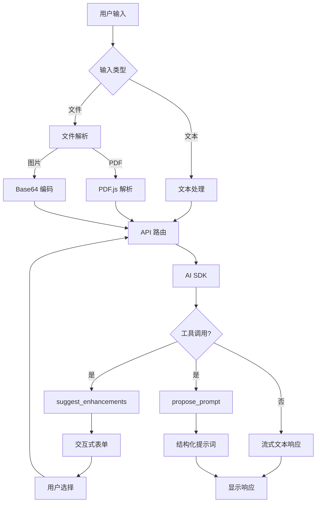

# 🚀 交互式提示词迭代器 - 让 AI 真正理解你的需求

> **一句话介绍**: 通过多轮交互式对话，将模糊想法转化为结构化、高质量的 AI 提示词

## 📌 项目背景

你是否遇到过这些问题：
- ❌ 给 AI 提问时不知道怎么描述需求
- ❌ AI 的回答总是偏离你的预期
- ❌ 想要精准的结果，但不知道如何优化提示词
- ❌ 每次都要手动调整提示词，效率低下

**交互式提示词迭代器**就是为了解决这些痛点而生的！

## ✨ 核心亮点

### 1. 🎯 智能交互引导
不需要你是提示词专家，AI 会主动询问：
- 你的角色定位是什么？
- 目标受众是谁？
- 需要什么深度的内容？
- 期望的输出格式？

通过**交互式表单**，几次点击就能明确需求！

### 2. 📁 多模态文件支持
- 📄 上传 PDF 论文，AI 自动解析内容
- 🖼️ 粘贴图片截图，AI 理解视觉信息
- 📊 支持 DOCX、TXT 等多种格式

### 3. 💾 本地优先 (Local-First)
- ✅ API Key 仅存储在浏览器本地
- ✅ 对话历史使用 IndexedDB 离线存储
- ✅ 无需担心隐私泄露

### 4. 🎨 现代化体验
- 深色模式支持
- 响应式设计（移动端友好）
- 基于 Shadcn/UI 的精美界面

## 🎬 实际效果演示

### 场景 1: 技术博客写作

**用户输入**: "帮我写一篇关于 React Server Components 的技术文章"

**AI 立即展示交互式表单**:

| 维度 | 可选项 |
|------|--------|
| 角色设定 | 资深前端工程师 / React 核心贡献者 / 技术布道师 |
| 目标受众 | 初学者 / 中级开发者 / 架构师 |
| 内容深度 | 入门概述 / 实战教程 / 架构深度解析 |
| 输出格式 | Markdown 博客 / 演讲稿 / 系列教程 |

**用户选择后，生成的提示词**:
```
你是一位拥有 5 年 React 开发经验的资深前端工程师。请撰写一篇面向中级开发者的技术文章,深入讲解 React Server Components 的工作原理、使用场景和最佳实践。

要求:
1. 包含实际代码示例和性能对比数据
2. 解释 RSC 与传统 SSR 的区别
3. 提供迁移指南和常见陷阱
4. 输出格式: Markdown,包含目录和代码高亮
5. 字数: 2000-3000 字
```

### 场景 2: 数据分析报告

**用户输入**: "分析这份销售数据并生成报告" + 上传 CSV 文件

**AI 解析文件后展示**:

| 维度 | 可选项 |
|------|--------|
| 分析角度 | 趋势分析 / 对比分析 / 预测分析 |
| 报告受众 | 技术团队 / 管理层 / 客户 |
| 可视化需求 | 图表建议 / 数据透视表 / 仪表盘设计 |
| 输出格式 | PPT 大纲 / Word 报告 / HTML 交互式报告 |

**生成的提示词**:
```
你是一位数据分析专家。基于提供的销售数据 CSV 文件,生成一份面向管理层的季度销售分析报告。

分析要求:
1. 识别销售趋势和异常波动
2. 对比不同产品线/区域的表现
3. 提供可操作的业务建议
4. 包含 3-5 个关键可视化图表(折线图、柱状图、饼图)
5. 输出格式: PPT 大纲,包含每页标题、要点和图表说明
```

## 🛠️ 技术实现

### 技术栈
- **前端**: Next.js 14.2 + TypeScript + Tailwind CSS
- **AI 集成**: Vercel AI SDK 6.0
- **状态管理**: Zustand 5.0
- **本地存储**: Dexie.js (IndexedDB)
- **文件解析**: pdfjs-dist 5.4

### 核心架构



## 🚀 快速开始

### 在线体验
👉 [https://interactive-prompt-iterator.vercel.app](https://interactive-prompt-iterator.vercel.app)

### 本地部署

```bash
# 1. 克隆仓库
git clone https://github.com/systemoutprintlnhelloworld/interactive-prompt-iterator.git
cd interactive-prompt-iterator

# 2. 安装依赖
npm install

# 3. 启动开发服务器
npm run dev

# 4. 访问 http://localhost:3000
```

### 配置说明

1. 点击右上角 **设置图标 (⚙️)**
2. 输入您的 AI API 配置：
   - **API Key**: OpenAI/Claude/其他兼容 API 的密钥
   - **Base URL**: API 端点地址（默认：`https://api.openai.com/v1`）
   - **Model**: 选择模型（支持 GPT-4o、Claude 3.5、DeepSeek 等）

> 💡 所有配置仅存储在浏览器本地，不会上传到服务器

## 🎯 支持的 AI 模型

- **OpenAI**: gpt-4o, gpt-4o-mini, gpt-4-turbo, o1, o1-mini
- **Anthropic Claude**: claude-3-5-sonnet, claude-3-5-haiku, claude-3-opus
- **国产大模型**: deepseek-chat, deepseek-reasoner, GLM-4-Plus, Qwen-Max, moonshot-v1-128k

## 📊 使用场景

✅ **技术写作**: 博客文章、技术文档、教程编写
✅ **数据分析**: 报告生成、数据可视化建议
✅ **学术润色**: 论文摘要优化、学术表达规范
✅ **UI 设计**: 需求文档、交互流程设计
✅ **代码生成**: 算法实现、代码重构建议
✅ **内容创作**: 营销文案、社交媒体内容

## 🗺️ 开发路线图

### ✅ v0.1.0 (已完成)
- 多轮交互式提示词优化
- 图片和 PDF 文件上传
- 本地存储对话历史
- 支持多种 AI 模型

### 🚧 v0.2.0 (进行中)
- [x] 优化长文本输入体验
- [x] 动态调整输入框高度
- [ ] Markdown 实时预览
- [ ] 提示词模板市场

### 🔮 v0.3.0 (计划中)
- 提示词质量评分系统
- 多轮对话上下文优化
- 智能推荐相关模板

## 💡 为什么选择这个项目？

### 对比传统方式

| 传统方式 | 交互式提示词迭代器 |
|---------|-------------------|
| 需要学习提示词工程 | 无需专业知识，AI 主动引导 |
| 手动反复调整 | 交互式表单，几次点击搞定 |
| 难以复用 | 支持模板保存和分享 |
| 无法处理文件 | 支持 PDF、图片等多模态输入 |

### 适合谁使用？

- 🎓 **学生**: 论文写作、学习笔记整理
- 💼 **职场人士**: 报告生成、邮件撰写
- 👨‍💻 **开发者**: 技术文档、代码注释
- 🎨 **设计师**: 需求文档、设计说明
- 📝 **内容创作者**: 文案策划、社交媒体内容

## 🤝 参与贡献

欢迎提交 Issue 和 Pull Request！

- 🐛 发现 Bug？[提交 Issue](https://github.com/systemoutprintlnhelloworld/interactive-prompt-iterator/issues)
- 💡 有新想法？[发起 Discussion](https://github.com/systemoutprintlnhelloworld/interactive-prompt-iterator/discussions)
- ⭐ 觉得有用？给个 Star 支持一下！

## 📞 联系方式

- GitHub: [systemoutprintlnhelloworld/interactive-prompt-iterator](https://github.com/systemoutprintlnhelloworld/interactive-prompt-iterator)
- 在线演示: [https://interactive-prompt-iterator.vercel.app](https://interactive-prompt-iterator.vercel.app)

---

## 🌟 Star History

[](https://star-history.com/#systemoutprintlnhelloworld/interactive-prompt-iterator&Date)

---

**⭐ 如果这个项目对你有帮助，欢迎给个 Star！**

**🚀 一键部署到 Vercel**: [](https://vercel.com/new/clone?repository-url=https://github.com/systemoutprintlnhelloworld/interactive-prompt-iterator)
